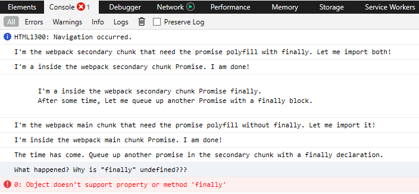
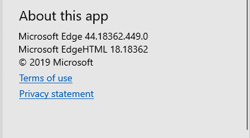
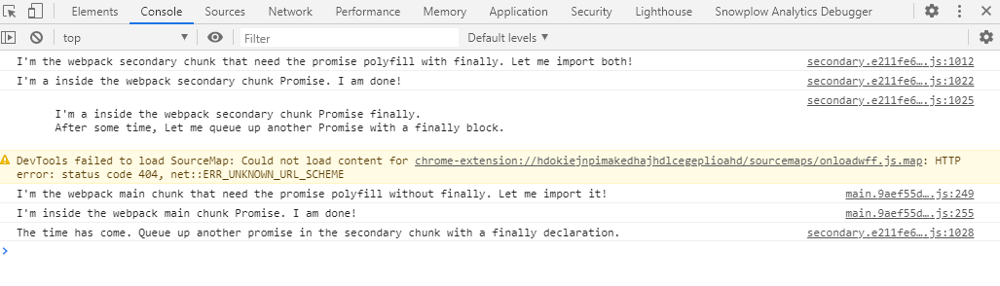
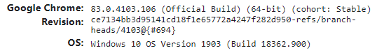

# Reproduction steps

To use this repository, please follow the following commands

```
npm install
npm run build
npm run host
```

You should be able to access this at http://127.0.0.1:8080 depending how your environment is configured.

## Browsers

To see the issue clearly, please run this in `Microsoft Edge 18` or `Internet Explorer 11.0`. The following output should occur:




This issue will likely not present itself in evergreen/modern browser experiences as `finally` is a part of their Promise specification. Here is an example in Chrome 83 without an error being thrown, but the polyfill instead likely being overwritten for native purposes




